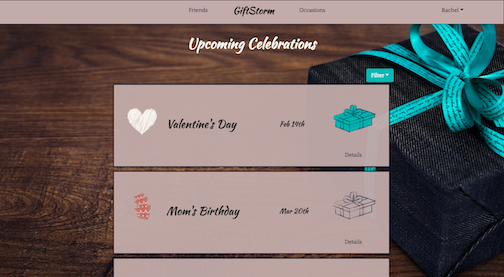
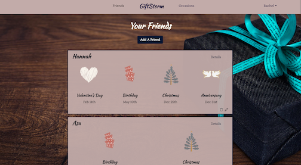
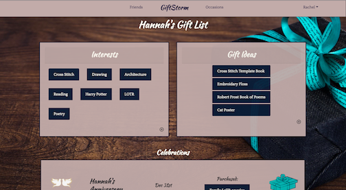
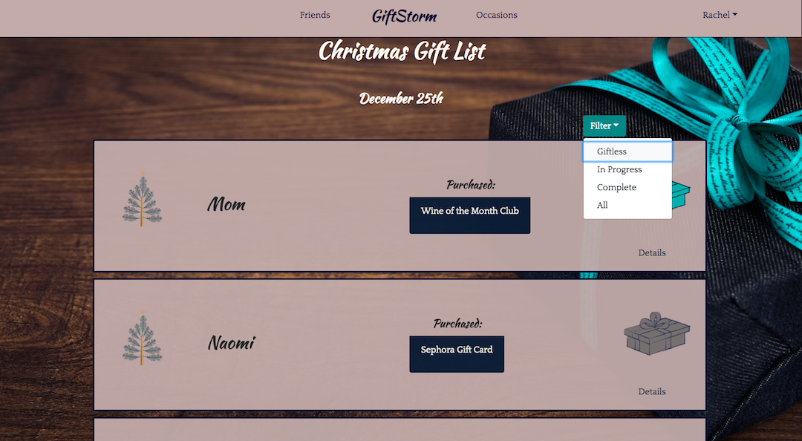

## GiftStorm: The Brainstorming App for Gift-Giving

As someone with a large immediate family, birthdays, anniversaries and other celebrations seem to sneak up on me on a monthly basis, leaving me not only gift-less, but idea-less.

To put an end to last-minute holiday scrambling, I created GiftStorm -- a React App that allows users to track interests, gift ideas, purchases and upcoming holidays for all of their friends in one, easy-to-use interface.

Using a local JSON database, the app stores all user-specific data, allowing unique experiences depending on the logged-in user. The app features full CRUD functionality, so users can add, update and delete interests, ideas and purchases, as well as what holidays they are tracking,  allowing the user to brainstorm freely and spontaneously.

GiftStorm uses Moment.js to display the closest upcoming celebrations to the user along with the status of their gift purchasing for that occasion.

The app is simple and user-friendly, styled with ReactStrap and Bootstrap CSS frameworks.

      

## Technologies Used

                  

## Install and Begin Brainstorming

Clone the app by running the following command in your terminal:
`git clone https://github.com/racheldaniel/Gift-Storm.git`

Run the following command to install all libraries and their dependencies:
`npm install`

GiftStorm uses a <b>database.json</b> file to store data. To create your own database, run:

```
mkdir api
cd api
touch database.json
```

Open <b>database.json</b> in your preferred editor and copy the following into the file to create a demo database:

```json
{
  "friends": [
    {
      "id": 1,
      "name": "Heather",
      "userId": 1
    },
    {
      "id": 2,
      "name": "Adam",
      "userId": 1
    },
    {
      "id": 3,
      "name": "Mom",
      "userId": 1
    },
    {
      "name": "Elaine",
      "userId": 1,
      "id": 4
    },
    {
      "name": "Nancy",
      "userId": 1,
      "id": 5
    },
    {
      "name": "Roger",
      "userId": 2,
      "id": 6
    },
    {
      "name": "Lydia",
      "userId": 1,
      "id": 7
    },
    {
      "name": "Dad",
      "userId": 1,
      "id": 8
    }
  ],
  "users": [
    {
      "id": 1,
      "displayName": "Test User",
      "email": "user@gmail.com",
      "password": "a"
    }
  ],
  "occasions": [
    {
      "id": 1,
      "name": "Christmas",
      "groupHoliday": "1",
      "date": "2018-12-25",
      "img": "https://i.imgur.com/cLCjP4P.png?1",
      "imgLg": "https://i.imgur.com/7A0FkZo.png"
    },
    {
      "id": 2,
      "name": "Birthday",
      "groupHoliday": "0",
      "date": "",
      "img": "https://i.imgur.com/a8UvJeU.png?1",
      "imgLg": "https://i.imgur.com/gZYjCYX.png?1"
    },
    {
      "id": 3,
      "name": "Anniversary",
      "groupHoliday": "0",
      "date": "",
      "img": "https://i.imgur.com/K0AID62.png?1",
      "imgLg": "https://i.imgur.com/UUMRzXn.png?1"
    },
    {
      "id": 4,
      "name": "Valentine's Day",
      "groupHoliday": "1",
      "date": "2019-02-14",
      "img": "https://i.imgur.com/OnmTlu2.png?1",
      "imgLg": "https://i.imgur.com/745gzx4.png?1"
    },
    {
      "id": 5,
      "name": "Mother's Day",
      "groupHoliday": "1",
      "date": "2019-05-12",
      "img": "https://i.imgur.com/g37i5pP.png?1)",
      "imgLg": "https://i.imgur.com/8GwU093.png?1"
    },
    {
      "id": 6,
      "name": "Father's Day",
      "groupHoliday": "1",
      "date": "2019-06-16",
      "img": "https://i.imgur.com/gJFOjzW.png?1",
      "imgLg": "https://i.imgur.com/N9QdtID.png?1"
    },
    {
      "id": 7,
      "name": "Boss' Day",
      "groupHoliday": "1",
      "date": "2019-10-16",
      "img": "",
      "imgLg": ""
    },
    {
      "id": 8,
      "name": "Hanukkah",
      "groupHoliday": "1",
      "date": "2019-12-02",
      "img": "",
      "imgLg": ""
    },
    {
      "id": 9,
      "name": "Galentine's Day",
      "groupHoliday": "1",
      "date": "2019-02-13",
      "img": "",
      "imgLg": ""
    },
    {
      "id": 10,
      "name": "Misc",
      "groupHoliday": "1",
      "date": "",
      "img": "",
      "imgLg": ""
    }
  ],
  "user_occasions": [
    {
      "id": 1,
      "userId": 1,
      "occasionId": 1
    },
    {
      "id": 2,
      "userId": 1,
      "occasionId": 2
    },
    {
      "id": 3,
      "userId": 1,
      "occasionId": 3
    },
    {
      "id": 5,
      "userId": 1,
      "occasionId": 5
    },
    {
      "id": 6,
      "userId": 1,
      "occasionId": 6
    },
    {
      "userId": 1,
      "occasionId": 4,
      "id": 7
    }
  ],
  "friend_occasions": [
    {
      "id": 3,
      "user_occasionId": 1,
      "date": "2018-12-25",
      "friendId": 3,
      "giftStatus": 1
    },
    {
      "id": 4,
      "user_occasionId": 3,
      "date": "2018-12-31",
      "friendId": 1,
      "giftStatus": 1
    },
    {
      "id": 6,
      "user_occasionId": 3,
      "date": "2019-06-30",
      "friendId": 3,
      "giftStatus": 0
    },
    {
      "id": 5,
      "user_occasionId": 5,
      "date": "2019-05-12",
      "friendId": 3,
      "giftStatus": 0
    },
    {
      "user_occasionId": 2,
      "date": "1994-03-22",
      "friendId": 5,
      "giftStatus": 0,
      "id": 9
    },
    {
      "user_occasionId": 2,
      "date": "2006-08-22",
      "friendId": 2,
      "giftStatus": 0,
      "id": 18
    },
    {
      "user_occasionId": 1,
      "date": "2018-12-25",
      "friendId": 5,
      "giftStatus": 0,
      "id": 19
    },
    {
      "user_occasionId": 2,
      "date": "1975-07-19",
      "friendId": 4,
      "giftStatus": 0,
      "id": 21
    },
    {
      "user_occasionId": 3,
      "date": "2018-03-25",
      "friendId": 4,
      "giftStatus": 0,
      "id": 22
    },
    {
      "user_occasionId": 6,
      "date": "2019-06-16",
      "friendId": 4,
      "giftStatus": 0,
      "id": 23
    },
    {
      "user_occasionId": 1,
      "date": "2018-12-25",
      "friendId": 4,
      "giftStatus": 1,
      "id": 24
    },
    {
      "user_occasionId": 1,
      "date": "2018-12-25",
      "friendId": 1,
      "giftStatus": 0,
      "id": 25
    },
    {
      "user_occasionId": 2,
      "date": "1991-05-10",
      "friendId": 1,
      "giftStatus": 0,
      "id": 26
    },
    {
      "user_occasionId": 1,
      "date": "2018-12-25",
      "friendId": 2,
      "giftStatus": 0,
      "id": 28
    },
    {
      "user_occasionId": 2,
      "date": "1964-03-20",
      "friendId": 3,
      "giftStatus": 0,
      "id": 33
    },
    {
      "user_occasionId": 1,
      "date": "2018-12-25",
      "friendId": 7,
      "giftStatus": 1,
      "id": 34
    },
    {
      "user_occasionId": 2,
      "date": "1997-03-20",
      "friendId": 7,
      "giftStatus": 0,
      "id": 35
    },
    {
      "user_occasionId": 1,
      "date": "2018-12-25",
      "friendId": 8,
      "giftStatus": 1,
      "id": 36
    },
    {
      "user_occasionId": 6,
      "date": "2019-06-16",
      "friendId": 8,
      "giftStatus": 0,
      "id": 37
    },
    {
      "user_occasionId": 7,
      "date": "2019-02-14",
      "friendId": 1,
      "giftStatus": 0,
      "id": 39
    },
    {
      "user_occasionId": 7,
      "date": "2019-02-14",
      "friendId": 4,
      "giftStatus": 0,
      "id": 40
    }
  ],
  "gifts": [
    {
      "name": "Wine of the Month Club",
      "friend_occasionId": 3,
      "id": 4
    },
    {
      "name": "Drafting Desk",
      "friend_occasionId": 25,
      "id": 5
    },
    {
      "name": "Family LoTR onesies",
      "friend_occasionId": 4,
      "id": 6
    },
    {
      "name": "Joking Hazard",
      "friend_occasionId": 28,
      "id": 8
    },
    {
      "name": "Bob Ross Hoodie",
      "friend_occasionId": 18,
      "id": 9
    },
    {
      "name": "Dungeon Master's Guide",
      "friend_occasionId": 34,
      "id": 12
    },
    {
      "name": "Air Fryer",
      "friend_occasionId": 36,
      "id": 13
    },
    {
      "name": "CardShark Illusion Cards",
      "friend_occasionId": 24,
      "id": 14
    },
    {
      "name": "Burlington Pjs",
      "friend_occasionId": 24,
      "id": 15
    }
  ],
  "friend_interests": [
    {
      "id": 1,
      "friendId": 1,
      "interest": "Cross Stitch"
    },
    {
      "id": 2,
      "friendId": 1,
      "interest": "Drawing"
    },
    {
      "id": 3,
      "friendId": 1,
      "interest": "Architecture"
    },
    {
      "id": 5,
      "friendId": 1,
      "interest": "Reading"
    },
    {
      "id": 6,
      "friendId": 2,
      "interest": "The Office"
    },
    {
      "id": 7,
      "friendId": 2,
      "interest": "Memes"
    },
    {
      "id": 8,
      "friendId": 2,
      "interest": "Board Games"
    },
    {
      "id": 9,
      "friendId": 3,
      "interest": "Wine"
    },
    {
      "id": 10,
      "friendId": 3,
      "interest": "Cooking"
    },
    {
      "id": 11,
      "friendId": 3,
      "interest": "Hosting/Events"
    },
    {
      "id": 12,
      "friendId": 3,
      "interest": "Canoeing"
    },
    {
      "friendId": 1,
      "interest": "Harry Potter",
      "id": 13
    },
    {
      "friendId": 1,
      "interest": "LOTR",
      "id": 14
    },
    {
      "friendId": 4,
      "interest": "Gadgets",
      "id": 15
    },
    {
      "friendId": 4,
      "interest": "Beard Products",
      "id": 16
    },
    {
      "friendId": 4,
      "interest": "Wes Anderson",
      "id": 17
    },
    {
      "friendId": 4,
      "interest": "Games",
      "id": 18
    },
    {
      "friendId": 4,
      "interest": "House Projects",
      "id": 19
    },
    {
      "friendId": 4,
      "interest": "Cats",
      "id": 20
    },
    {
      "friendId": 5,
      "interest": "Makeup",
      "id": 21
    },
    {
      "friendId": 5,
      "interest": "Painting/Drawing",
      "id": 22
    },
    {
      "friendId": 5,
      "interest": "Wine",
      "id": 23
    },
    {
      "friendId": 7,
      "interest": "D&D",
      "id": 24
    },
    {
      "friendId": 7,
      "interest": "Coloring",
      "id": 25
    },
    {
      "friendId": 7,
      "interest": "Video Games",
      "id": 26
    },
    {
      "friendId": 7,
      "interest": "Karaoke",
      "id": 27
    },
    {
      "friendId": 8,
      "interest": "Puzzles",
      "id": 28
    },
    {
      "friendId": 8,
      "interest": "Bourbon",
      "id": 29
    },
    {
      "friendId": 8,
      "interest": "Painting",
      "id": 30
    },
    {
      "friendId": 8,
      "interest": "Theology",
      "id": 31
    },
    {
      "friendId": 8,
      "interest": "Easy Cooking",
      "id": 32
    },
    {
      "friendId": 1,
      "interest": "Poetry",
      "id": 33
    }
  ],
  "friend_giftIdeas": [
    {
      "id": 6,
      "friendId": 2,
      "giftIdea": "The Office Trivia Game"
    },
    {
      "id": 7,
      "friendId": 2,
      "giftIdea": "App Store Credit"
    },
    {
      "id": 9,
      "friendId": 3,
      "giftIdea": "Outdoor Gear"
    },
    {
      "friendId": 1,
      "giftIdea": "Cross Stitch Template Book",
      "id": 11
    },
    {
      "friendId": 1,
      "giftIdea": "Embroidary Floss",
      "id": 12
    },
    {
      "friendId": 2,
      "giftIdea": "Ultimate TV Themes Piano Book",
      "id": 13
    },
    {
      "friendId": 4,
      "giftIdea": "Cat Calendar",
      "id": 15
    },
    {
      "friendId": 5,
      "giftIdea": "Sephora Gift Card",
      "id": 16
    },
    {
      "friendId": 7,
      "giftIdea": "Publix GiftCard",
      "id": 17
    },
    {
      "friendId": 8,
      "giftIdea": "Engraved Tumblers",
      "id": 18
    },
    {
      "friendId": 2,
      "giftIdea": "Michael Scott Bust",
      "id": 21
    },
    {
      "friendId": 1,
      "giftIdea": "Robert Frost Book of Poems",
      "id": 22
    },
    {
      "friendId": 1,
      "giftIdea": "Cat Poster",
      "id": 23
    },
    {
      "friendId": 5,
      "giftIdea": "US Art Supply Oil Paints",
      "id": 24
    }
  ]
}
```
When you're ready to run the app:
``` npm start ``` 

Open [http://localhost:3000](http://localhost:3000) to view it in the browser.

To view demo data, log in with user@gmail.com, password "a". To customize the app with your family and friend data, create a new user/password.

Happy Brainstorming!


